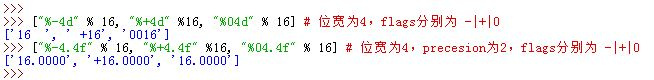
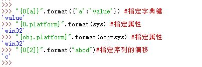
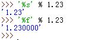

   

* 占位符有多种：  
 `%s`：字符串； `%r`：也是字符串，但用`repr()`得到的而不是`str()`；  
  `%c`：字符； `%d`：十进制整数； `%i`：整数； `%e`：浮点指数；  
  `%f`： 浮点十进制；`%%`：百分号 `%`， `%g`：自动转成浮点`%e`或者`%f`  
  

* 转换通用目标结构为：`%[(key_name)][flags][width][.precision]type`
	* `key_name`：用于从右边字典中取对应键的值（此时右边的是字典对象，而不是元组）
	  如：`"%(n)%d %(x)%s" %{"n":3,"x":"apples"}` 
	* `flags`：如果为`-`则左对齐；如果为`+`则为正负号；如果为`0`：则补零
	* `width`： 指定位宽（包括小数点在内），至少为`width`字符宽度
	* `precision`：指定小数点后几位
		>`width`和`precision`可以为`*`，表示它们从输入的下一项中取值
		（即从元组中取得）
	* `type`为类型，如`d`,`r`,`f`,`e`等  
  	

11.格式化字符串除了使用字符串格式化表达式之外，还可以通过字符串的`.format()`
  方法达到同样的效果。

* `.format()`方法支持位置参数、关键字参数、以及二者的混合。
	* 位置参数： `"{0},{1},{2}".format('abc','def','ghi')`
	* 关键字参数：`"{k1},{k2},{k3}".format(k1='abc',k2='def',k3='ghi')`
	* 混合使用：`"{0},{1},{k}".format('abc','def',k='ghi')`  
  
* 格式化字符串中可以指定对象的属性、字典键、序列的索引：
	* 指定字典的键：`"{0[a]}".format({'a':'value'})`，
	  注意这里的键`a`并没有引号包围
	* 指定对象的属性：`"{0.platform}".format(sys)`，也可以用关键字参数：
	  `"{obj.platform}".format(obj=sys)`
	* 指定序列的索引：`"{0[2]}".format("abcd")` ，这里只能进行正索引值，且不能分片 
  	
* 通用目标结构为： `{fieldname!conversionflag:formatspec}`
	* `fieldname`为位置数字 0,1,2,... 或者为关键字，它后面可选地跟随
		* `.name`：则指定对象的属性
		* `[index]`：指定了索引
		* `[key]`：指定了字典的键
	* `conversionflag`为转换标记，可以为：
		* `r`：在该值上调用一次`repr()`函数
		* `s`：在该值上调用一次`str()`函数
		* `a`：在该值上调用一次`ascii()`函数
	* `formatspec`为格式，其结构为：
	   `[[fill] align] [sign] [#] [0] [width] [.precision] [type]`
		* `fill`一般与`align`为`=`时配合
		* `align`为对齐：
			* `<`：左对齐
			* `>`：右对齐
			* `=`：必须指定`fill`（单个字符），此时用这个字符填充
			* `^`：居中对齐
		* `sign`：为正负号标记
		* `#`：作用未知
		* `0`：补0
		* `width`：位宽
		* `.precision`：精度
		* `type`：为类型，如`d`,`r`,`f`,`e`等，
		  但与格式化字符串表达式相比，多了`b`（二进制格式输出）  
      	
	* 某些值可以从`.format()`的参数中获取，如`"{0:+0{1}d}".format(128,8)`，
	  其指定精度信息从`format()`的参数中取(参数8)

12.格式化单个值比较简单，可以有以下方法：

* `"%s" % 1.23`
* `"%s" % (1.23,)`，这里`(1.23,)`是一个单元素元组，
  而`(1.23)`是一个表达式
* `"{0}".format(1.23)`

13.由于Python内部会暂存并重复使用短字符串来进行优化，因此该短字符串在内存中只有一份。  

14.浮点数格式化时，采用`%s`说明符与`%f`说明符，其结果不同：  

因为按照`%f`格式化输出时，浮点数有精度和位宽的设定（虽然这里没有显式指定，但是它们有默认值）。而`%s`格式化输出时，首先调用了`str()`函数，然后再进行输出。

​	

